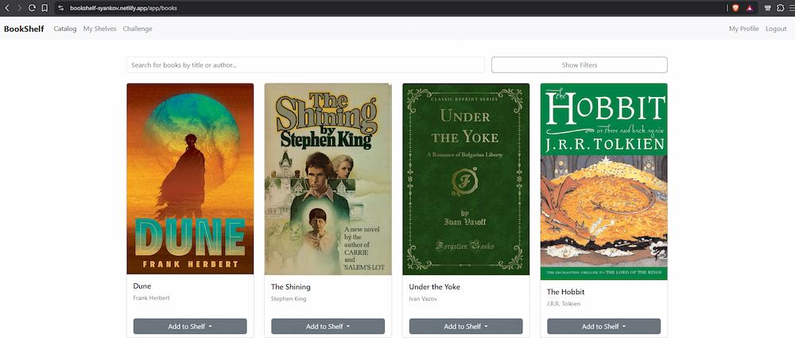

# Book Shelf (Goodreads clone)

> [!IMPORTANT]
> **Project Status: Deployed**
> This repository contains the **final project** for the "Java Web - May 2026" module at **Software University**.

---

## Overview

Book Shelf provides a REST API and Angular user interface for managing a book catalogue, personal bookshelves, reviews, user accounts, delegated moderation, and yearly reading challenges.

The main application owns identity, catalogue, bookshelf, and review data. A separate reading-challenge microservice owns reading-goal data. The main application communicates with the microservice through Spring Cloud OpenFeign and forwards the authenticated user's JWT.

## Table of Contents

- [Overview](#overview)
- [Live Demo](#live-demo)
- [Architecture and Technologies](#architecture-and-technologies)
- [Implemented Features](#implemented-features)
- [Backend Application Structure and Features](#backend-application-structure-and-features)
- [Frontend Application Structure and Features](#frontend-application-structure-and-features)
- [Reading Challenge Microservice](#reading-challenge-microservice)
- [Project Structure](#project-structure)
- [Installation and Setup](#installation-and-setup)
- [Configuration](#configuration)
- [Local Email Verification and Password Reset](#local-email-verification-and-password-reset)
- [Admin Recovery CLI](#admin-recovery-cli)
- [Testing and Coverage](#testing-and-coverage)
- [Docker and Hosted Deployment](#docker-and-hosted-deployment)
- [Local Development Credentials](#local-development-credentials)
- [Reviewer Walkthrough](#reviewer-walkthrough)
- [License](#license)
- [Acknowledgments](#acknowledgments)
- [Repositories](#repository)

## Live Demo

- **Frontend:** [Open the hosted Book Shelf application](https://bookshelf-syankov.netlify.app)
- **Backend API documentation:** [Open the hosted Swagger UI](https://bookshelf-app-syankoff-dev.apps.rm2.thpm.p1.openshiftapps.com/swagger-ui.html)
- **Reading Challenge Service:** internal OpenShift service, accessed only through the main application

> [!NOTE]
> The backend runs in the OpenShift Developer Sandbox. The platform may idle workloads after inactivity, and hosted availability depends on the sandbox remaining active. The local setup remains the reproducible review path.

> [!IMPORTANT]
> The credentials documented below are for the self-hosted local development environment. They do not provide access to the hosted application. Hosted administrator credentials are not published in this repository.

### Hosted Catalogue

[](docs/images/book-catalogue.png)

_Click the screenshot to open the full-resolution hosted catalogue._

## Architecture and Technologies

### Architecture

```text
        Browser
           │
           ▼
        Angular SPA on Netlify
           │ HTTPS
           ▼
        Book Shelf REST API on OpenShift
           ├── Main PostgreSQL database
           ├── Redis cache
           └── Feign request with forwarded JWT
                     │
                     ▼
              Reading Challenge Service
                     │
                     ▼
              Dedicated PostgreSQL database
```

### Technology Stack

- **Backend:** Java 21, Spring Boot 3.4.0, Gradle
- **Frontend:** Angular 22, standalone components, Signals, Bootstrap
- **Database:** PostgreSQL with Flyway migrations
- **Security:** Spring Security with stateless JWT authentication
- **Microservice communication:** Spring Cloud OpenFeign
- **Caching:** Spring Cache with Redis
- **API documentation:** OpenAPI and Swagger UI
- **Testing:** JUnit 5, Mockito, AssertJ, Testcontainers, Vitest, JSDOM
- **Coverage:** JaCoCo with a 70% line-coverage gate
- **Containerization:** Docker and Docker Compose
- **Hosting:** Netlify and OpenShift Developer Sandbox
- **File storage integration:** Cloudinary with a configuration-controlled no-op fallback

## Implemented Features

### Identity and Access Management

- Public self-registration with duplicate-account checks
- Email-verification tokens
- Login with JWT issuance and validation
- Single-use password-reset tokens
- Forced password change for selected accounts
- Profile and password management
- Administrative account lock and unlock operations
- Temporary account locks with scheduled expiry reconciliation
- Roles: `USER` and `ADMIN`
- Delegated permissions: `MODERATE_REVIEWS` and `MODERATE_BOOKS`

### Book Discovery

- Public paginated catalogue
- Faceted catalogue search
- Detailed book view
- Author, genre, language, publisher, format, ISBN, and publication metadata
- Cover-image URLs and optional image upload through the configured storage provider

### Bookshelf Management

- Create personal bookshelves
- Add books to a bookshelf
- Remove books from a bookshelf
- Paginate bookshelf contents
- Enforce bookshelf ownership

### Reviews

- Create, edit, and delete reviews
- Prevent duplicate reviews by the same user for the same target
- Enforce review ownership
- Delegate review moderation through `MODERATE_REVIEWS`

### Catalogue Administration

Administrators can create, edit, and delete:

- books;
- authors;
- genres;
- languages;
- publishers.

Operations that would violate database relationships return a conflict response instead of an unhandled database error.

### Content Moderation

- Administrators can moderate books and bookshelves
- Users with `MODERATE_BOOKS` can moderate book metadata
- Users with `MODERATE_REVIEWS` can remove reviews
- Administrators can grant and revoke delegated permissions
- Permission changes apply after the affected user receives a new JWT


### Reading Challenges

- Create one challenge per user and year
- Set a yearly reading goal
- Retrieve a challenge by year
- Update books-read progress
- Recalculate completion when progress changes
- Persist challenge data in a separate microservice database

## Backend Application Structure and Features

### System Foundation

- REST controllers with DTO/entity separation
- Jakarta Bean Validation for request models
- Centralized RFC 7807 `ProblemDetail` handling
- Flyway-controlled database schema
- UUID identifiers
- Optimistic locking through `@Version`
- Joined inheritance for the user hierarchy
- Transaction boundaries in the service layer

### Services and Repositories

- One Spring Data repository per persistence entity
- Service-layer business rules and ownership checks
- Paginated queries for catalogue, user, review, and bookshelf flows
- `JOIN FETCH` queries where required to avoid N+1 access patterns
- Case-insensitive duplicate checks for catalogue reference data
- Referential-integrity handling for delete operations

### Security

- Stateless JWT authentication
- URL-level and method-level authorization
- Authorities embedded in JWT claims
- Password hashing through Spring Security
- Custom `401` and `403` `ProblemDetail` responses
- Delegated permission model in addition to roles
- Prevented administrator self-lock actions

### Scheduling and Caching

- Cron-based purge of expired verification and password-reset tokens
- Fixed-delay reconciliation of expired temporary account locks
- Book detail caching through Spring Cache
- Redis-backed JSON cache with a 30-minute time-to-live
- Cache eviction on update, delete, and moderation operations
- In-memory cache fallback through configuration

### Cross-Cutting Concerns

- `@LogExecutionTime` advice for selected service operations
- `@Audited` advice for selected administrative and moderation actions
- Application event for deleting remote book-cover assets only after transaction commit

### Image Storage

The application defines an `ImageUploadService` abstraction with two implementations:

- `CloudinaryImageUploadService` when `cloudinary.enabled=true`
- `NoOpImageUploadService` when Cloudinary is disabled or not configured

The no-op implementation allows the application and automated tests to run without Cloudinary credentials.

## Frontend Application Structure and Features

### Core Authentication

- JWT storage and decoding through `AuthService`
- Functional interceptor for Bearer-token propagation
- Route guards for authenticated, administrative, and delegated-permission routes
- Password-change guard for accounts that require rotation

### Public Area

- Public catalogue
- Book details
- Login
- Registration
- Email verification
- Forgot password
- Reset password

### Authenticated Area

- Personal profile
- Password change
- Bookshelf management
- Book details and add-to-shelf actions
- Review management
- Reading challenge

### Administration and Moderation

- User administration
- Permission management
- Book moderation
- Review moderation
- Bookshelf moderation
- Author management
- Genre management
- Language management
- Publisher management

The frontend uses a generated OpenAPI client. Development requests use `proxy.conf.json`; production builds use the hosted OpenShift API base path.

## Reading Challenge Microservice

The reading-challenge service is an independent Spring Boot application running on port `8081`.

The service:

- owns a dedicated PostgreSQL database;
- exposes `POST`, `GET`, and `PUT` challenge operations;
- validates JWTs propagated by the main application;
- does not issue tokens or manage sessions;
- is deployed without a public OpenShift Route.

The hosted main application reaches it using the internal service address:

```text
http://reading-challenge-svc:8081
```

#### Reading Challenge

[](docs/images/reading-challenge.png)

_Click the screenshot to open the full-resolution reading-challenge view._


See the [Reading Challenge Service repository](https://github.com/StefanYankov/reading-challenge-svc) for its setup and deployment details.

## Project Structure

```text
book-shelf/
├── 📂 .github/
│   └── 📂 workflows/
│       ├── 📄 backend-ci.yaml
│       └── 📄 frontend-ci.yaml
│
├── 📂 frontend/
│   ├── 📂 public/
│   │   └── 📄 _redirects              # Netlify SPA rewrite
│   ├── 📂 src/
│   │   ├── 📂 app/
│   │   │   ├── 📂 api/                # Generated OpenAPI client
│   │   │   ├── 📂 core/               # Authentication, guards, interceptors
│   │   │   ├── 📂 features/           # Public, user, admin, moderation pages
│   │   │   ├── 📂 layout/             # Public, user, and admin layouts
│   │   │   └── 📂 shared/             # Shared UI components and types
│   │   ├── 📂 environments/           # Development and production API paths
│   │   └── 📄 main.ts
│   ├── 📄 angular.json
│   ├── 📄 package.json
│   └── 📄 proxy.conf.json
│
├── 📂 src/
│   ├── 📂 main/
│   │   ├── 📂 java/bg/softuni/bookshelf/
│   │   │   ├── 📄 BookShelfApplication.java
│   │   │   ├── 📂 config/             # Security, cache, Feign, scheduling
│   │   │   ├── 📂 data/
│   │   │   │   ├── 📂 entity/         # JPA entities and value objects
│   │   │   │   ├── 📂 enums/          # Domain and security enums
│   │   │   │   └── 📂 repository/     # Spring Data repositories
│   │   │   ├── 📂 service/
│   │   │   │   ├── 📂 auth/           # Authentication and tokens
│   │   │   │   ├── 📂 author/         # Author operations
│   │   │   │   ├── 📂 book/           # Book catalogue operations
│   │   │   │   ├── 📂 bookshelf/      # Personal bookshelf operations
│   │   │   │   ├── 📂 challenge/      # Reading-challenge proxy
│   │   │   │   ├── 📂 genre/          # Genre operations
│   │   │   │   ├── 📂 language/       # Language operations
│   │   │   │   ├── 📂 publisher/      # Publisher operations
│   │   │   │   ├── 📂 review/         # Review operations
│   │   │   │   └── 📂 user/           # User and permission management
│   │   │   ├── 📂 shared/
│   │   │   │   ├── 📂 aop/            # Timing and audit advice
│   │   │   │   ├── 📂 dto/            # Shared response DTOs
│   │   │   │   ├── 📂 exception/      # Business errors and codes
│   │   │   │   ├── 📂 infrastructure/ # Email and image storage
│   │   │   │   └── 📂 security/       # Shared security helpers
│   │   │   └── 📂 web/
│   │   │       ├── 📂 controller/     # REST controllers
│   │   │       └── 📄 GlobalExceptionHandler.java
│   │   └── 📂 resources/
│   │       ├── 📂 db/
│   │       │   ├── 📂 migration/       # Versioned Flyway migrations
│   │       │   └── 📂 dev-seed/        # Local demonstration data
│   │       ├── 📄 application.yaml
│   │       └── 📄 application-dev.yaml
│   └── 📂 test/
│       └── 📂 java/bg/softuni/bookshelf/ # Unit, slice, API, integration tests
│
├── 📄 build.gradle
├── 📄 compose.yaml
├── 📄 Dockerfile
└── 📄 README.md
```

## Installation and Setup

### Prerequisites

- Java 21
- Docker Desktop
- Node.js 24 and npm
- Git

### 1. Clone both repositories

```bash
git clone https://github.com/StefanYankov/book-shelf.git
git clone https://github.com/StefanYankov/reading-challenge-svc.git
```

### 2. Configure local infrastructure

The Docker Compose files read database and Redis settings from local environment variables.

`.env`
```text
DB_USER=
DB_PASSWORD=
DB_NAME=
CLOUDINARY_ENABLED=
CLOUDINARY_CLOUD_NAME=
CLOUDINARY_API_KEY=
CLOUDINARY_API_SECRET=
```

### 3. Start the main PostgreSQL and Redis services

From the main repository:

```bash
docker compose up -d
```

### 4. Start the reading-challenge microservice

Follow the microservice README and run `ReadingChallengeSvcApplication` with the `dev` profile on port `8081`.

The main application can start without the microservice, but reading-challenge requests will return a service-unavailable response.

### 5. Start the main backend

Run `BookShelfApplication` with the `dev` Spring profile active.

- Backend: `http://localhost:8080`
- Swagger UI: `http://localhost:8080/swagger-ui.html`
- Health endpoint: `http://localhost:8080/actuator/health`

The development profile applies Flyway migrations, loads demonstration data, enables Redis, and creates local development accounts.

### 6. Start the Angular frontend

```bash
cd frontend
npm ci
npm start
```

Open `http://localhost:4200`.

## Configuration

### Main application

| Variable | Purpose |
|---|---|
| `JWT_SECRET_KEY` | Base64-encoded JWT signing key |
| `APP_CORS_ALLOWED_ORIGINS` | Allowed frontend origin |
| `READING_CHALLENGE_SERVICE_URL` | Reading-challenge service URL |
| `CACHE_TYPE` | Select Redis or in-memory caching |
| `SPRING_DATASOURCE_URL` | PostgreSQL JDBC URL |
| `SPRING_DATASOURCE_USERNAME` | PostgreSQL username |
| `SPRING_DATASOURCE_PASSWORD` | PostgreSQL password |

### Redis

| Variable | Purpose |
|---|---|
| `SPRING_DATA_REDIS_HOST` | Redis host |
| `SPRING_DATA_REDIS_PORT` | Redis port |
| `SPRING_DATA_REDIS_PASSWORD` | Redis password where required |

### Cloudinary

| Variable | Purpose |
|---|---|
| `CLOUDINARY_ENABLED` | Enable the Cloudinary implementation |
| `CLOUDINARY_CLOUD_NAME` | Cloudinary cloud name |
| `CLOUDINARY_API_KEY` | Cloudinary API key |
| `CLOUDINARY_API_SECRET` | Cloudinary API secret |

## Local Email Verification and Password Reset

Local development uses `NoOpEmailServiceImpl`. The application creates verification and reset tokens normally and writes the action link to the backend console instead of sending email.

### Account Verification

#### 1. Locate the Verification Link

Submit the registration form and inspect the backend console for the `NoOpEmailServiceImpl` block:

```text
INFO  --- [nio-8080-exec-7] b.s.b.s.auth.AuthenticationServiceImpl   : Email verification token generated for user [example-user].
INFO  --- [nio-8080-exec-7] b.s.b.s.i.email.NoOpEmailServiceImpl     : ==========================================================================
INFO  --- [nio-8080-exec-7] b.s.b.s.i.email.NoOpEmailServiceImpl     : 📧 MOCK EMAIL DISPATCHED
INFO  --- [nio-8080-exec-7] b.s.b.s.i.email.NoOpEmailServiceImpl     : Type: EMAIL VERIFICATION
INFO  --- [nio-8080-exec-7] b.s.b.s.i.email.NoOpEmailServiceImpl     : To: example@bookshelf.local
INFO  --- [nio-8080-exec-7] b.s.b.s.i.email.NoOpEmailServiceImpl     : Action Required: Please click the following link to activate your account.
INFO  --- [nio-8080-exec-7] b.s.b.s.i.email.NoOpEmailServiceImpl     : Link: http://localhost:4200/verify?token=example-token
INFO  --- [nio-8080-exec-7] b.s.b.s.i.email.NoOpEmailServiceImpl     : ==========================================================================
INFO  --- [nio-8080-exec-7] b.s.b.s.auth.AuthenticationServiceImpl   : Verification email sent to: example@bookshelf.local
```

#### 2. Verify the Account

1. Copy the verification link from the console.
2. Paste the link into the browser.
3. The Angular route submits the token to `/api/auth/verify-email`.
4. Sign in after the account is activated.

### Resolving Login via Password Reset

For an account without known credentials, such as `user5`, use the reset flow to assign a password hashed by the current runtime encoder:

1. Navigate to the **Forgot Password** page.
2. Enter the account email, for example `user5@bookshelf.com`.
3. Locate the dispatched reset link in the backend console:

   ```text
   📧 MOCK EMAIL DISPATCHED
   Type: PASSWORD RESET
   Link: http://localhost:4200/reset-password?token=example-reset-token
   ```

4. Open the link in the browser.
5. Submit and confirm the new password.
6. Sign in using the new password.

## Admin Recovery CLI

If the primary administrator is locked out in a self-hosted environment, a user with server access can run the Spring Shell recovery command.

1. Access the server where the application JAR is available.
2. Run the password-reset command:

   ```bash
   java -jar app.jar --spring.shell.command.script.enabled=true force-password-reset <username>
   ```

3. Retrieve the generated one-time password from the console:

   ```text
   Password for user 'admin' has been reset to: <generated-one-time-password>
   ```

4. Transmit the temporary password through a separate secure channel.
5. The account must change the password after the next login.

## Testing and Coverage

### Backend

Run tests, generate JaCoCo reports, and enforce the line-coverage gate:

```bash
./gradlew clean check
```

Windows PowerShell:

```powershell
.\gradlew clean check
```

Verified results:

- **502 tests passed**
- **93% JaCoCo line coverage**
- **80% branch coverage** for information only
- **70% minimum line coverage** enforced through Gradle `check`

HTML report:

```text
build/reports/jacoco/test/html/index.html
```

Backend CI runs `./gradlew check` for pushes and pull requests targeting `master`.

### Frontend

```bash
cd frontend
npm ci
npm run lint
npm test -- --watch=false
npm run build -- --configuration=production
```

Frontend CI runs linting, Vitest, and the production build.

## Docker and Hosted Deployment

### Docker Images

```text
syankoff/bookshelf-app:1.0.0
syankoff/reading-challenge-svc:1.0.0
```

Build the main image locally:

```bash
docker build -t bookshelf-app .
```

### Hosted Topology

| Component | Platform | Access |
|---|---|---|
| Angular frontend | Netlify | Public HTTPS |
| Main Book Shelf API | OpenShift | Public HTTPS route |
| Reading Challenge Service | OpenShift | Internal service only |
| Main PostgreSQL | OpenShift | Internal service only |
| Challenge PostgreSQL | OpenShift | Internal service only |
| Redis | OpenShift | Internal service only |

The hosted databases and Redis use persistent volume claims. The OpenShift Developer Sandbox may scale inactive workloads to zero replicas without deleting the associated persistent volumes.

Netlify build settings are configured in the Netlify project UI:

- Base directory: `frontend`
- Build command: `npm run build`
- Publish directory: `dist/book-shelf-ui/browser`
- Production branch: `master`

The repository uses `frontend/public/_redirects` for Angular SPA route rewriting.

## Local Development Credentials

> [!IMPORTANT]
> These credentials are created by the local `dev` profile. These credentials do not provide access to the hosted deployment.

| Account | Username | Password | Role / Permission | Intended Review Flow |
|---|---|---|---|---|
| Administrator | `admin` | `admin` | `ADMIN` | Administration; password change required at first login |
| Standard user | `user1` | `password` | `USER` | Standard authenticated operations |
| Standard user | `user2` | `password` | `USER` | Additional user-owned data |
| Review moderator | `user3` | `password` | `USER`, `MODERATE_REVIEWS` | Delegated review moderation |
| Book moderator | `user4` | `password` | `USER`, `MODERATE_BOOKS` | Delegated book moderation |
| Password-reset user | `user5` | Reset required | `USER` | Password-reset demonstration |

Permissions are embedded in the JWT. Sign out and sign in again after a permission change to receive updated authorities.

The hosted environment uses separate credentials. Hosted administrator credentials are not stored in this repository.

## Reviewer Walkthrough

### Hosted Review

1. Open the hosted frontend.
2. Browse and search the public catalogue.
3. Open book details and inspect seeded cover images.
4. Confirm that the Netlify frontend calls the OpenShift API.

The hosted deployment does not publish administrator credentials.

### Local Review

1. Start both repositories and the required Docker infrastructure.
2. Sign in as `user1`.
3. Create a bookshelf and add a book.
4. Create, update, and delete a review.
5. Create a reading challenge and update progress.
6. Sign in as `user3` and verify delegated review moderation.
7. Sign in as `user4` and verify delegated book moderation.
8. Sign in as `admin`, change the initial password, and review account, permission, catalogue, and moderation operations.
9. Run `./gradlew clean check` and inspect the JaCoCo report.
10. Run frontend linting, tests, and the production build.

## License

This project is licensed under the MIT License.

## Acknowledgments

Developed for the [Java Web - May 2026 module](https://softuni.bg/modules/120/java-web-may-2026/1629) at [Software University](https://softuni.bg/).

## Repositories

[Book Shelf repository](https://github.com/StefanYankov/book-shelf)
[Reading Challenge Service repository](https://github.com/StefanYankov/reading-challenge-svc) 
